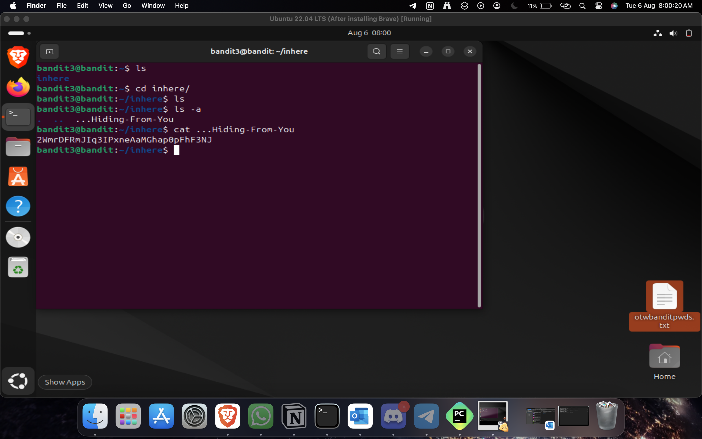
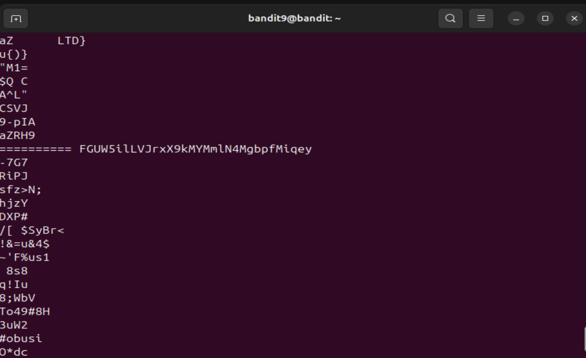

# Level 0

Well I already knew how to ssh, but since they mentioned port number, I didn't know the argument (yeah, i guessed it'd most likely be -p), so I looked at the man page and just gave the -p arg and got on with it.

Password to login into level 0: bandit0

# Level0-1

Used the commands ls to list all the files in the home directory and then used "cat readme" (name of the file was readme), to print its contents.

Password to login into level 1: ZjLjTmM6FvvyRnrb2rfNWOZOTa6ip5If

# level1-2

Again, similar to the previous level, used ls command to find the file named "-" and I used cat - and it didn't work out, then I saw the resource mentioned in for dashed filenames, and found out you have to use cat./- for special characters. 

Password to login into level 2: 263JGJPfgU6LtdEvgfWU1XP5yac29mFx

# level2-3

This level was also similar/same as we just had to put the file name in quotations in cat command as the file name had spaces in it. 

Password to login into level 3: MNk8KNH3Usiio41PRUEoDFPqfxLlSmx 

# level 3-4

In this level, after using the cd command and changing directory to the "inhere" directory, I used the manpage of ls to find the arguement for showing all files. Then ran the command ls -a to find the file and used cat command again to print its contents.

Password to login into level 4: 2WmrDFRmJIq3IPxneAaMGhap0pFhF3NJ

# level 4-5

For this level though, I used some of my prior knowledge. I had tinkered around a lot with a raspi, so I knew this already. To find the human readable file, it was just file ./* which would print the data types of all the files in the current directory. from there, it was only one file with ascii text, so I just printed its contents using cat ./-file07, which also again prints all the contents inside the file07.

Password to login into level 5: 40QYVPkxZOOE005pTW81FB8j81xXGUQw

# level5-6

For this level, I started reading the man page for finding the arguments for the given conditions, and I found the size arguement. So I just ran the command with only the size argument and to my luck, there was only one file.

Commands used:  find -size 1033c,  cat ./maybehere07/.file2

Password to login into level 6: HWasnPhtq9AVKe0dmk45nxy20cvUa6EG

# level 6-7

This one took me a bit of a time, because I had to read the man page of find for all the arguments and even after writing the command, I got a lot of results. I was dumbfounded and was just randomly scrolling through all the hits when I saw only one file did not have "Permission denied" and that one file conveniently also had the name "bandit7.password", so I just used the cat command next and printed its contents.

Commands Used: find / -type f -user bandit7 -group bandit6 -size 33c, 
               cat /var/lib/dpkg/info/bandit7.password

Password to login into level 7: morbNTDkSW6jIlUcOymOdMaLnOlFVAaj

# level 7-8

As soon as I read this challenge, I knew exactly what I had to do because of my prior knowledge again and my preference to use nano as my text editor over vim. I just used nano data.txt and then used ctrl+w to use the "find" feature. 

Commands used: nano data.txt, ctrl+w > millionth

Password to login into level 8: dfwvzFQ¡4mU©wfNbFOe9RWskMLg7eEc

# level 8-9

This level was also pretty easy as we just had to use the sort command and I already knew the argument.

Commands used: sort data.txt | uniq -c

Password to login into level 9: 4CKMh1JI91bUIZZPXDqGanal4xvAg0JM

# level 9-10

At first, I tried to use the nano editor and the "find" option in that, but that didn't work out I have no idea why. Then I read the "commands you may need to solve this level" and started to go through the man pages of every command listed there. I just saw the first line of man page of strings and knew this would work, because it would print only the printable characters of the txt file, so i just ran strings data.txt and voila, I just scrolled up a bit and found the password. But maybe, I could've also used a combination of grep (current thought, didn't occur at that time), would have been easier.

Commnands used: strings data.txt

Password to login into level 10: FGUW5ilLVJrxX9kMYMmlN4MgbpfMiqey

