# level 10-11

This level was also direct. I just had to look at the manpage of base64 and figure out the right way to arguments (looking back at it now, I don't even know why I wrote the wrong commands).

Commands used: base64 -d data.txt

Password to login into 11: dtR173fZKb0RRsDFSGsg2RWnpNVj3qR

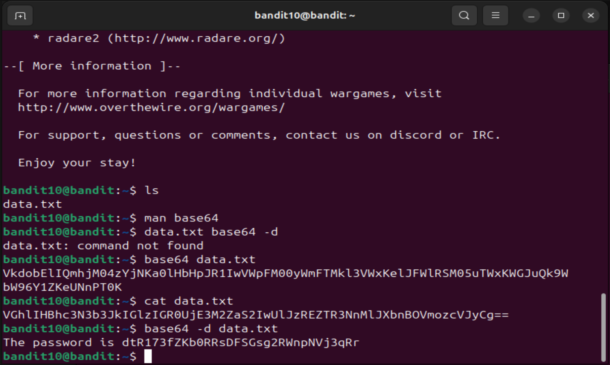

# level 11-12

Oh man, this level literally took up all of my brain cells. I had to get help from 2 seniors to get this done. I think out of all the 22 levels I've done, this might have been the longest I've ever took to complete a level. I read the manpage of tr command and thought I did everything correctly, but the logic I missed was second half of alphabets' reverse collating order. That took me time.

Commands used: cat data.txt | tr [a-z][A-Z] [n-za-m][N-ZA-M]

Password to login into level 12: 7x16WNeHIi5YkIhWsfFIqoognUTyj9Q4

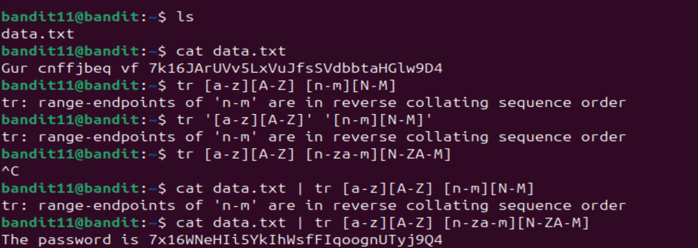

# level 12-13

Even in this level, I had problems with making the temp directory, so had to get help from a senior again. But apart from that, this was the longest level, but it was easy only for the most part. I just had to look at the file type, then see the manpage for that file type and uncompress it and repeat that process over and over, dozens of times.

Commands used: (Yeah, its better I just attach the screenshots instead of typing them again here)

Password to login into level 13: F05dwFscOcbaliH0h8J2eUks2vdTDwAn

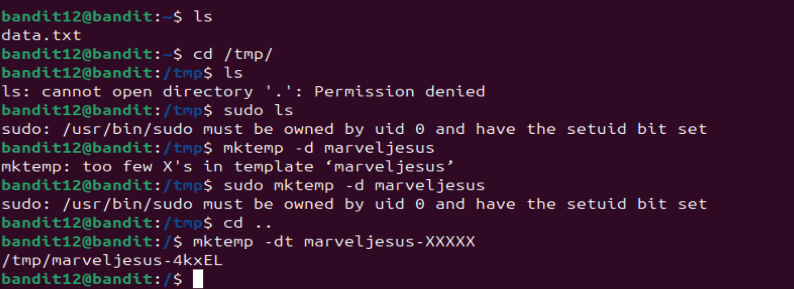 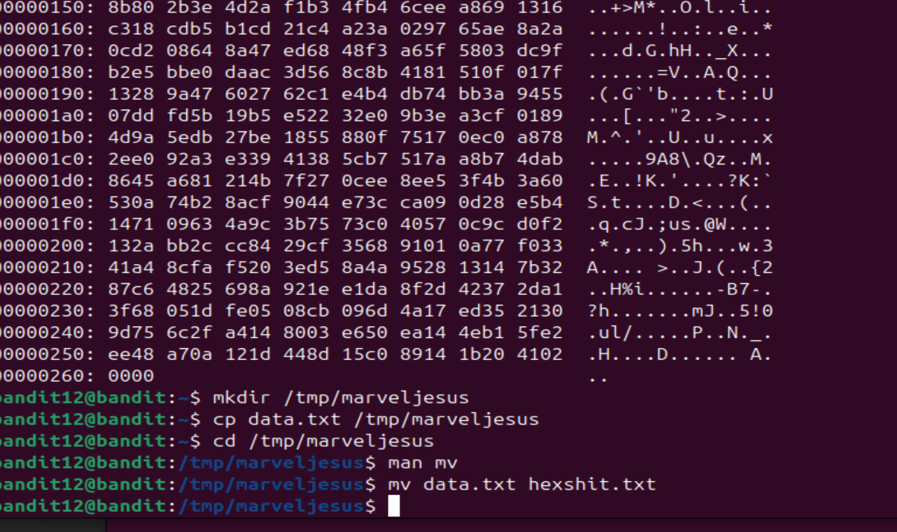 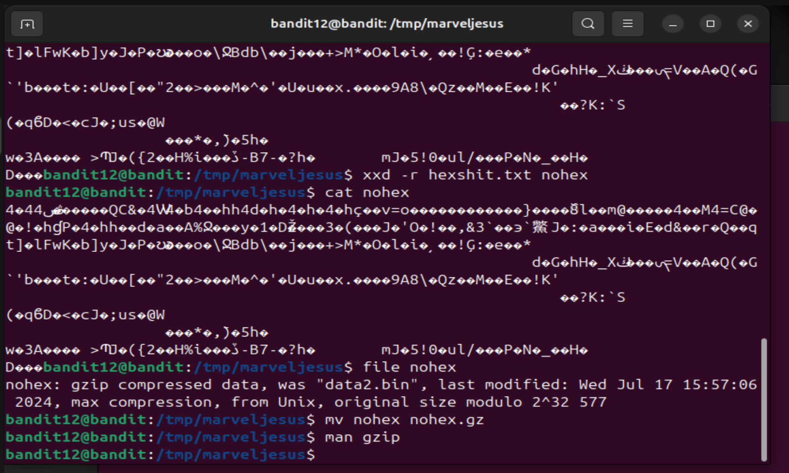 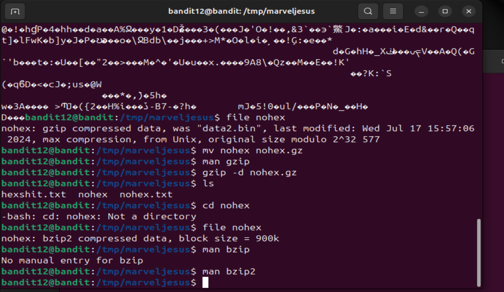 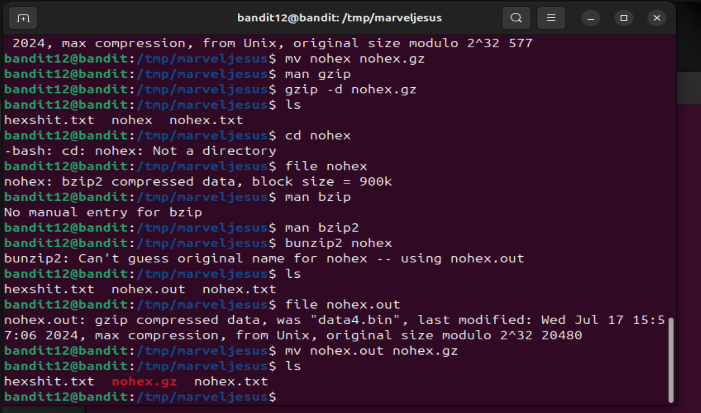 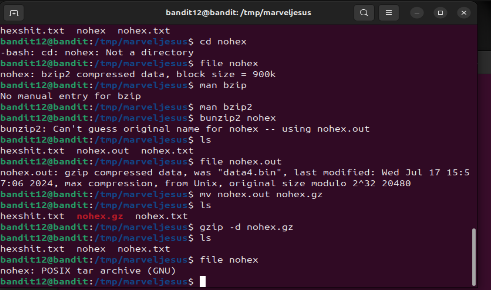 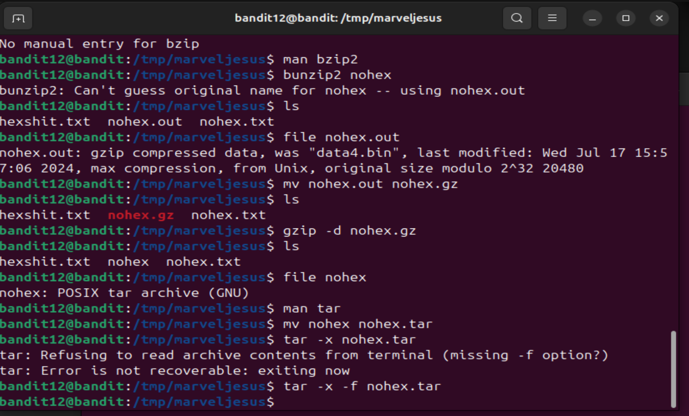 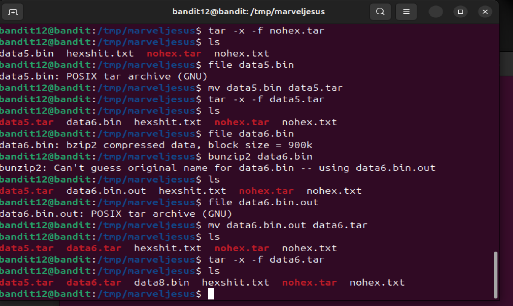 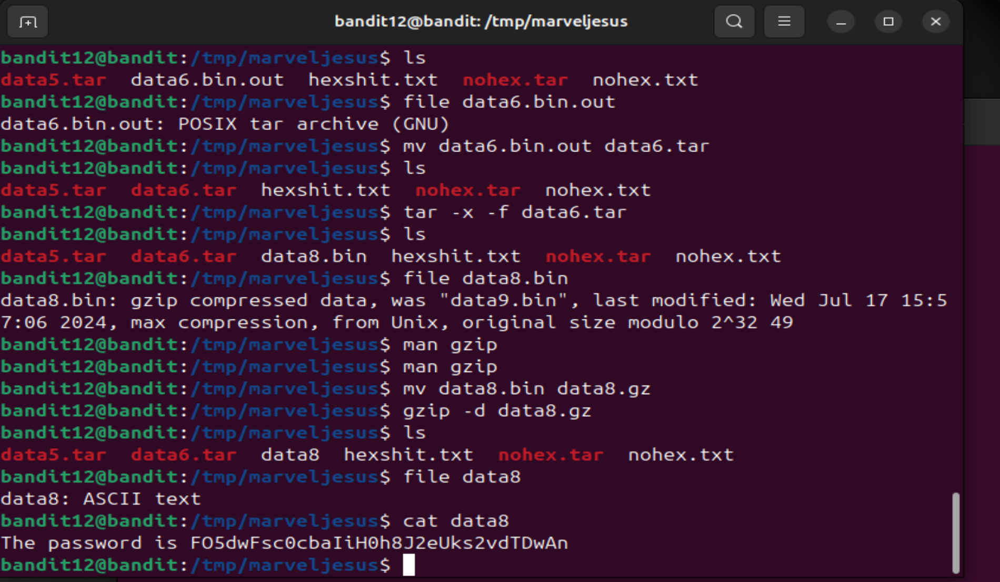

# level 13-14

1. Used the ls command and found the ssh key.
2. Used nano and opened the key, and copied.
3. On my local machine, used nano to create a new file and pasted the ssh key into it.
4. Then went through the man page of ssh and found the arguement was -i, so did ssh -i /home/Desktop/nayan/sshkey bandit14@bandit.labs.overthewire.org -p 2220. Got a wrong permissions error for the ssh key.
5. I knew I had to use the chmod command, but didn't know the arguments, so I used the manpage of ssh, and then used chmod u=rwx sshkey
6. Now i reran the command and logged into level14.
7. Next i directly ran cat /etc/bandit_pass/bandit14 and got the password.

Password to log into level 14: sshkey or MU4VWeTyJk8ROof1qqmcBPaLh71DCPvS

# level 14-15

1. So yet again, I was clueless as to how send inputs to a port on localhost, so I started reading the man pages of all the commands listed in "Commands you may need to solve this level". Read telnet first, then read nc and found that this was the command needed.

2. Then ran the command nc localhost 30000, sent this level's password and it returned next level's password.

Password to login into level 15: 8xCjnmgoKbGLhHFAZlGE5Tmu4M2tKJQo

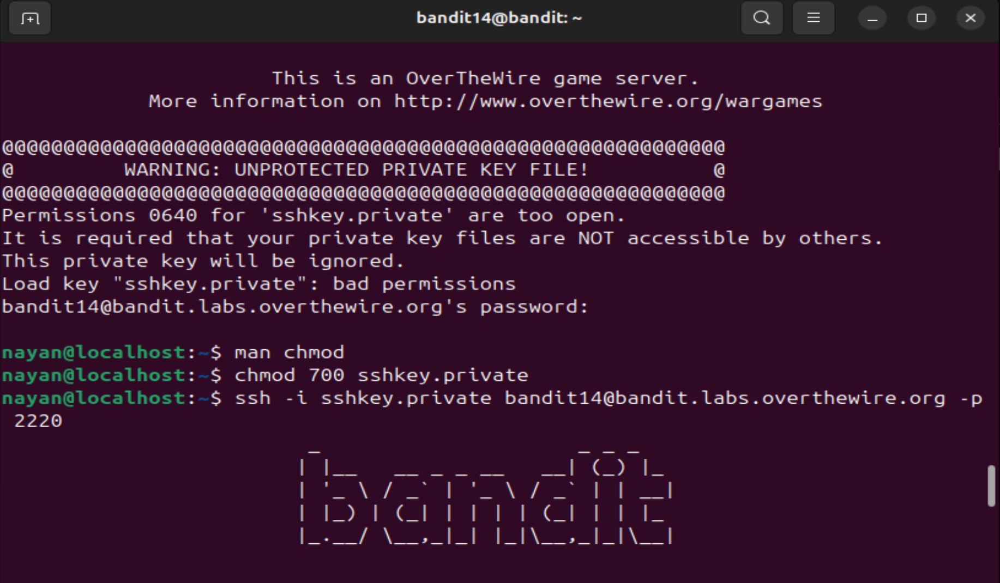 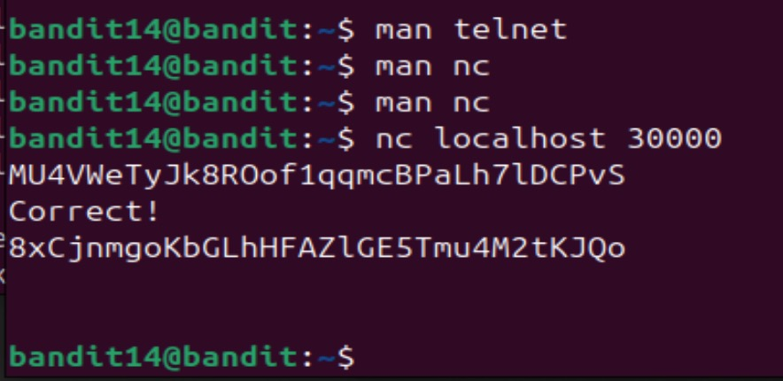

# level 15-16

1. Yet again, I had to start from scratch for this level. Ngl, figuring out the command took some time. Started with man page of openssl because the command had ssl in its name, figured that would be it.
2. Upon reading the man page, got to know that we would need to include another sub command named s_client, so included that and ran the following command: openssl s_client localhost 30001, got an error and it asked me to run openssl s_client -help.
3. After running that, got to know I missed an arguement named -connect and that we would have to write the host and port not with a space between them, but with a colon.
4. So now I ran openssl s_client -connect localhost:30001, gave the password for this level and got the password for the next level.

Password to login into level 16: kSkvUpMQ71BYyC4GBPvCvT1BfWRy0Dx

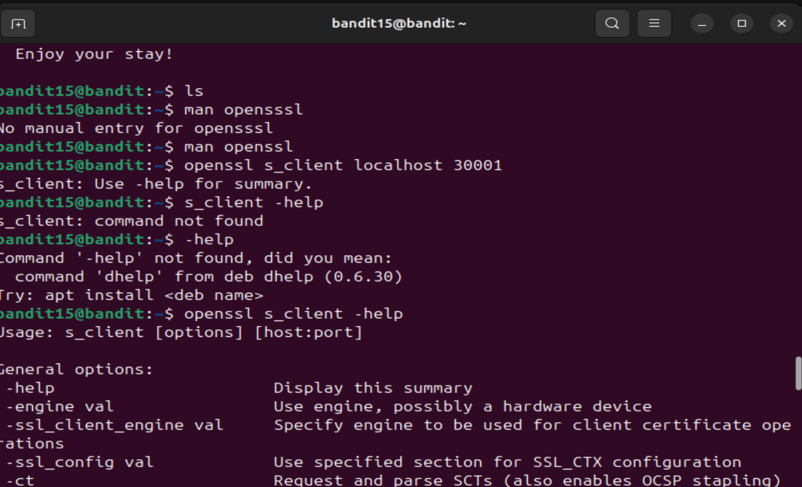 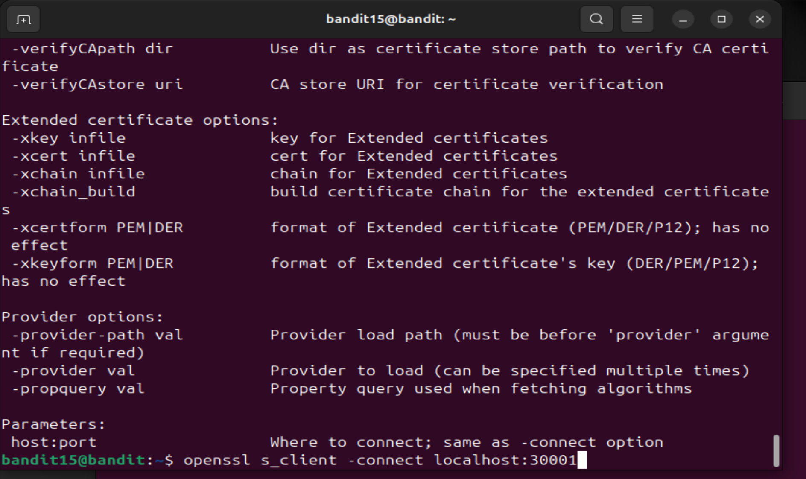 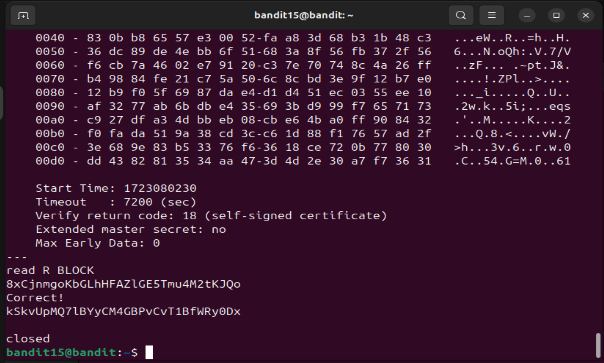

# level 16-17

1. Upon reading this level's objective, from my prior knowledge of tinkering with raspi, I knew the first command I'd have to use was nmap, so I just started with the man page of nmap to find the args required for it.

2. Ran the command nmap -p 31000-32000 localhost, and it returned 5 ports.

3. Now I used openssl s_client -connect localhost:[port number] and found the right port by trial and error since there were only 5 ports and I wasn't really in the mood to spend another half an hour going through all the man pages.

4. After finding the port, I sent the current level's password, but instead of getting the next level's password, I got "KEYUPDATE" back. I remember seeing that word under the objective, and upon reading, the question asked me to see the connected commands in the man page. The solution was literally in the man page, I just had to include another -quiet argument in my command.

5. Reran the command with -quiet arg and got an sshkey for the next level.

Password for login into level 17: sshkey

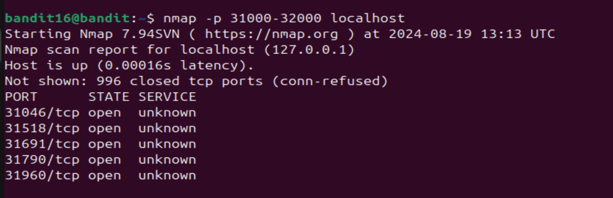